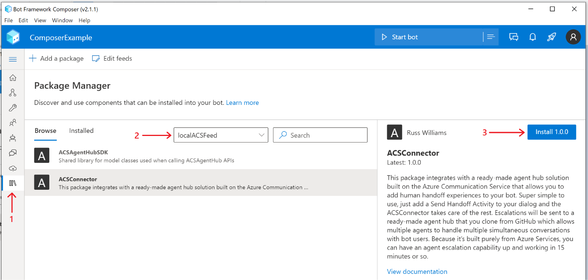
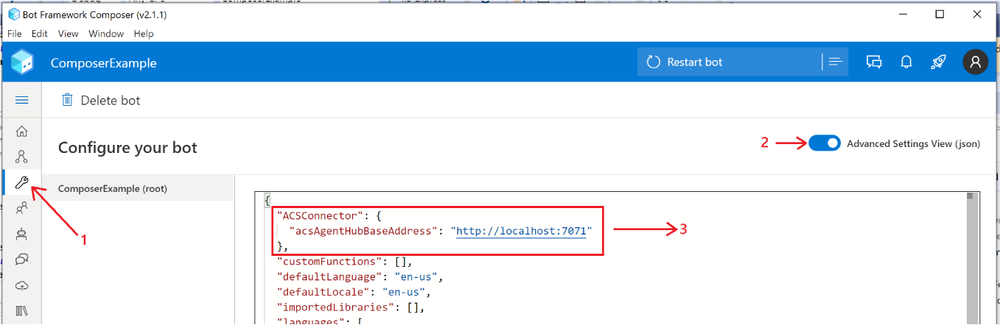
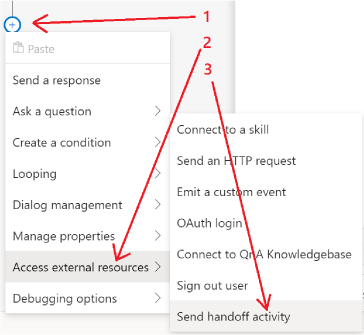
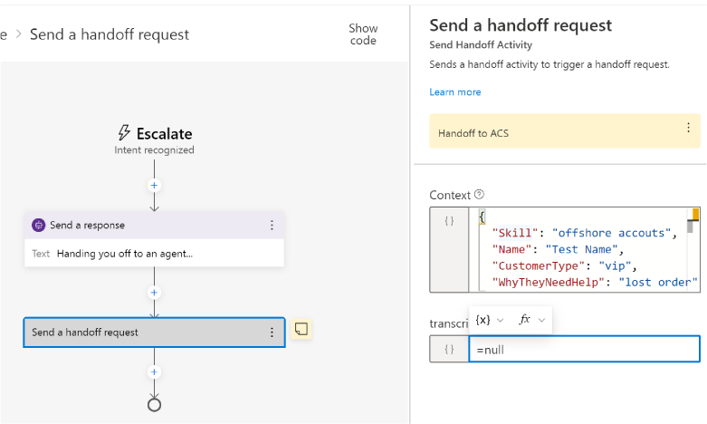

# ACS Agent Hub
This package integrates with a ready-made agent hub solution built on the Azure Communication Service that allows
you to add human handoff experiences to your bot. Super simple to use, just add a Send Handoff Activity to your
dialog and the ACSConnector takes care of the rest. Escalations will be sent to a ready-made agent hub that you
clone from GitHub which allows multiple agents to handle multiple simultaneous conversations with bot users.
Because it's built purely from Azure Services, you can have an agent escalation capability up and working in 15
minutes or so.

### Prerequisites
Successful use of this package requires the installation of a set of prerequisites so if you haven't installed them
yet, browse the the [ACS Agent Hub Prerequisites](http://aka.ms/acshub#prerequisites) and install them

### Getting Started

Getting started couldn't be easier.  Simply clone the ACS Agent Hub repo and run a single deployment script and 
you're ready to run add escalation to your bot.  There are a variety of escalation scenarios you can support and
we've captured a number of them in this [short video](http://add-demo-here) you can watch to get a sense of how things work.

1) **To Clone the ACS Agent Hub Repo**  
Open PowerShell and run the following command:
```
git clone https://github.com/managedcoder/ACSAgentHub
```
2) **To Get Everything Setup, Run the Deployment Script**  
In PowerShell, change the current directory to the root solution folder (i.e., the one
that contains the ACSAgentHub.sln file). Then run the following script to deploy and
configure all the services required by the ACS Agent Hub:
```
.\Deployment\Scripts\deploy_and_configure.ps1 -hubName <hub name> -resourceGroup <resource group> $ngrokFullPath <ngrok path> -location <location name> -NuGetFullPath <nuget path>
```
where:
- **\<hub name>** is the name of your agent hub which will also be used as part of the name of
other services created by this script
- **\<resource group>** is the name of the resource group that services will be deployed to
- **\<ngrok path>** is the full path to the ngrok.exe (e.g., c:\nuget\ngrok.exe)
- **\<location name>** is the Azure location name of the region that services will be deployed in
- **\<nuget path>** is the full path to the nuget.exe (e.g., c:\nuget\nuget.exe)

### Explore Escalation Scenarios
To make it easy for you to quickly experiment with the ACS Agent Hub we've included sample applications that are all
ready to go.  All you need to do to try it out is to open the Bot Framework Composer and select the **Open** link on
the Home tab and open the ComposerExample that's in the root folder of the solution. This is a very simple bot with 
an Escalate trigger that you can look at to see how to code an escalation and then try it out by using the 
**Start bot** command.  After the bot starts, choose the **Open Web Chat** option in the flyout menu that appears
when the bot finishes it's startup processing.  Type, _**talk to human**_ to start an escalation experience.  There's
a short [demo video](http://add-demo-here) you can watch that shows all these steps and various escalation and agent
management scenaios you can replicate using this sample app.

### Adding Escalation to Your Bot
The sample is nice for quickly experimenting with escalation and taking a look at how it's coded, but it doesn't 
address how to add escalation to bots.  The good news is that adding agent escalation to a Composer bot is very 
simple and only involves a few steps.  The following steps are shown in a very short video 
[here](http://adding-escalation-=video) that you might find easier to follow.

1) **Install Agent Hub Package** - First, create a local feed and set its URL property to the full path of the
.\ACSConnector\localFeed folder so Composer will know where find the package and second, add the ACSConnector package
to your bot as shown in the following screen shots, respectively<br>
<br>

2) **Set App Setting** - Paste the following at the top of the bot's appsettings.json file:<br>
```
  "ACSConnector": {
    "acsAgentHubBaseAddress": "http://localhost:7071"
  },
```


3) **Add an Escalation Action** - Add a _**Send handoff activity**_ action to any dialog and at wherever point makes
sense for your bot<br> 

4) **Set Escalation Action Properties** - Paste the following escalation payload into the **Context** property of escalation action and set **Transcription**
to ```=null```:<br>
```
{
  "Skill": "offshore accounts",
  "Name": "Test Name",
  "CustomerType": "vip",
  "WhyTheyNeedHelp": "lost order"
}
```
The properties and values above are defined by the agent hub you're escalating to.  So, for example, the payload
is unique to LivePerson or Omnichannel and you'd check their documentation to find out what the payload should
look like for those agent hub solutions but, for the ACS Agent Hub you'll use the above payload and replace the
hardcoded sample values with the appropriate values (use the values above if you are just experimenting).  

Currently, 
the **Skill** and **CustomerType** properties are not being used by the ACS Agent Hub and can be set to whatever
you like or left empty.  The **Name** and **WhyTheyNeedHelp** properties are used in the agent-portal and the 
ComposerExample shows a nice way to gather and set those properties.  When you're finished, it should look like
this:<br>


That's it!  You now ready to start your bot and trigger an escalation and explore/repeat the escalation scenarios
shown in this [short demonstration](http://add-demo-here)
