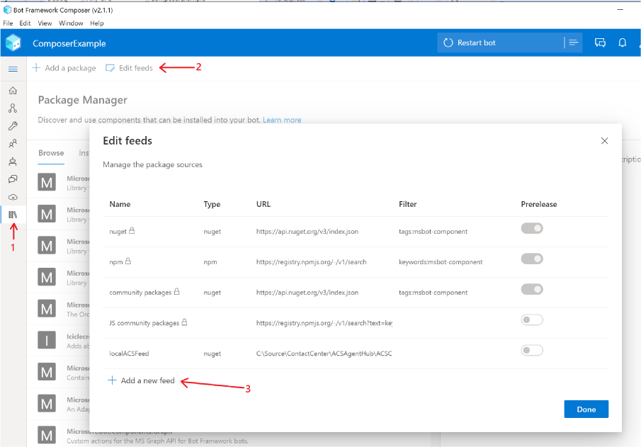
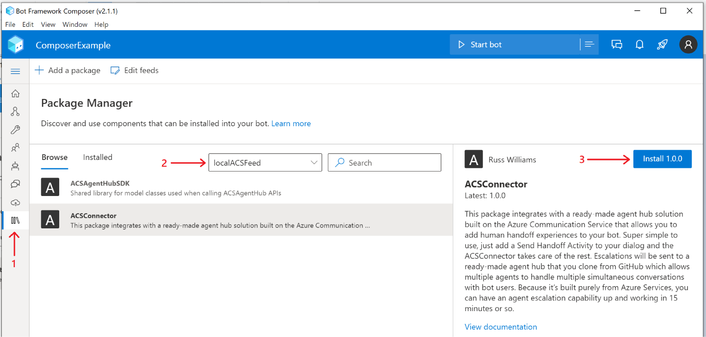
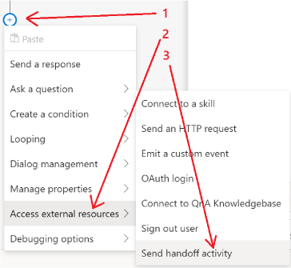
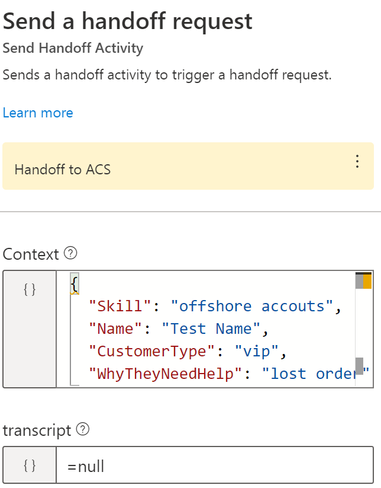
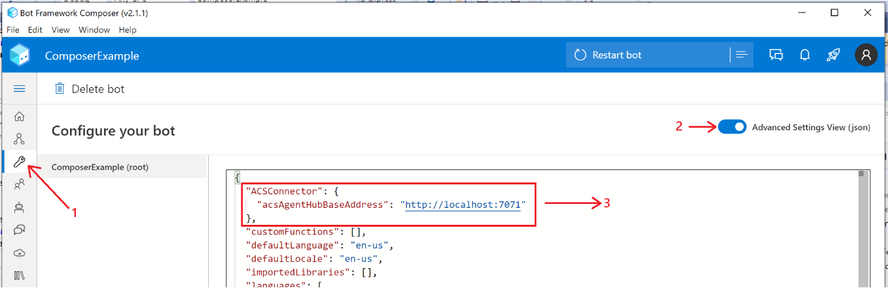

# ACS Agent Hub
The sample uses the Azure Communication Service and Azure Bot Service to implement a
contact center "call deflection" pattern where multiple agents can simultaneously engage 
with multiple customers in a ready-made agent portal that's also included in the solution

### <a name="Prerequisites"></a>Prerequisites

#### Ngrok
To install ngrok, follow instructions [here](https://ngrok.com/download)

#### Azure CLI
The deployment scripts require Azure CLI version 2.22.0 or newer which you can install from [here](
https://docs.microsoft.com/en-us/cli/azure/install-azure-cli-windows?tabs=azure-cli).

#### Azure Communication Service CLI Extension

To install the Azure Communication Service extension, run the following from a command prompt:
```
az communication create
```
#### Web PubSub CLI Extension
To install the Web PubSub extension, run the following from a command prompt
```
az webpubsub
```
Note - The output of this command may be messy with a lot of diagnostics before it prompts to
install the extension so be aware of that.

#### Azure Functions Core Tools
The core agent hub logic lives in a set APIs in the ACSAgentHub Azure Function project and to quickly
test things out you can run it locally from the command line but you'll need to have the Azure 
Functions Core Tools v3.X installed.  Alternatively, you can avoid installing the Azure Functions Core
Tools if you use Visual Studio to run the ACSAgentHub Azure Function project.

To install Azure Function Core Tools v3.X you'll need to download and run the Core Tools installer, based on your version of Windows:

* [v3.x - Windows 64-bit](https://go.microsoft.com/fwlink/?linkid=2135274)
* [v3.x - Windows 32-bit](https://go.microsoft.com/fwlink/?linkid=2135275)

#### Install Bot Framework Composer
The ACS Agent Hub works with any kind of bot built on the Microsoft Conversational AI platform (PVA, Composer, 
Virtual Assistant Template, or SDK bot) but the quickest and easyiest way to get up and running is to use the
Composer sample included in this solution and to do that you'll need to install the Bot Framework Composer
[here](https://docs.microsoft.com/en-us/composer/install-composer?tabs=windows)

### <a name="GettingStarted"></a>Getting Started

Getting started couldn't be easier.  Simply clone the repo and run a deployment script and you're ready
to run the sample app and try out all the escalation scenarios shown in this [demo video](http://add-demo-here).
The deployment script does require that you've taking care of the [prerequisites](#Prerequisites) or it will fail.

1) **Clone the ACS Agent Hub Repo**  
Open PowerShell and run the following command:
```
git clone https://github.com/managedcoder/ACSAgentHub
```
2) **Deploy ACS Agent Hub**  
In PowerShell, change the current directory to the root solution folder (i.e., the one
that contains the ACSAgentHub.sln file). Then run the following script to deploy and
configure all the services required by the ACS Agent Hub:
```
.\Deployment\Scripts\deploy_and_configure.ps1 -hubName <hub name> -resourceGroup <resource group> -location <location name> -NuGetFullPath <nuget path>
```
where:
- **\<hub name>** is the name of your agent hub which will used in creating the various
required services
- **\<resource group>** is the name of the resource group that services will be deployed to
- **\<location name>** is the Azure location name of the region that services will be deployed in
- **\<nuget path>** is the full path to the nuget.exe (e.g., c:\nuget\nuget.exe)

### <a name="ExploreEscalationScenarios"></a>Explore Escalation Scenarios
To make it easy for you to quickly experiment with the ACS Agent Hub we've included sample applications that are all
ready to go.  All you need to do to try it out is to open the Bot Framework Composer and select the **Open** link on
the Home tab and open the ComposerExample that's in the root folder of the solution. This is a very simple bot with 
an Escalate trigger that you can look at to see how to code an escalation and then try it out by using the 
**Start bot** command.  After the bot starts, choose the **Open Web Chat** option in the flyout menu that appears
when the bot finishes it's startup processing.  Type, _**talk to human**_ to start an escalation experience.  There's
a short [demo video](http://add-demo-here) you can watch that shows all these steps and various escalation and agent
management scenaios you can replicate using this sample app.

### <a name="AddingEscalationToYourBot"></a>Adding Escalation to Your Bot
The samples are nice for quickly experimenting with escalation and taking a look at how it's coded, but they don't 
address how to add escalation to bots.  The good news is that adding agent escalation to a Composer bot is very 
simple and only involves a few steps.  These following steps are shown in a very short video [here](http://adding-escalation-=video)
that you might find easier to follow.
1) **Install Agent Hub Package** - First create a local feed so Composer will know where the package lives and second,
add the ACSConnector package to your bot as show in the following screen shots, respectively<br>
<br>

2) **Add Escalation Action** - Add a _**Send handoff activity**_ action to any dialog and wherever it makes sense in your bo<br> 

3) **Set Escalation Action Properties** - Paste the following escalation payload into **Context** property of escalation action and set **Transcription**
to ```=null``` as shown below: <br>
```
{
  "Skill": "<skill 1> <skill 2> <skill N>",
  "Name": "<bot user's name>",
  "CustomerType": "<customer class (e.g., vip, premium, etc.>",
  "WhyTheyNeedHelp": "<reason for help request>"
}
```
The properties and values above are defined by the agent hub you're escalating to.  So, for example, the payload
unique for LivePerson or Omnichannel and you'd check their documentation to find out what that is but for
the this agent hub solution you'll use the above payload.  Currently, the **Skill** and **CustomerType** are not
being used and can be set to whatever you like or left empty.  The **Name** and **WhyTheyNeedHelp** properties
are used in the agent-portal and the ComposerExample shows a nice way to gather and set those properties.<br>

4) **Set App Setting** - Paste the following at the top of the bot's appsettings.json file:<br>
```
  "ACSConnector": {
    "acsAgentHubBaseAddress": "http://localhost:7071"
  },
```


### <a name="AddingAgentEscalationToNewOrExistingBot"></a>Appendix A: Agent Escalation in a VA Template Bot
If you want to add agent escalation to a Virtual Assistant Template bot, you can explore
how that's done in the VATemplateExample sample project.  If you want to quickly test this
out, you can open PowerShell and change the current directory to the VATemplateExample 
project folder (i.e., the one that contains the VATemplateExample.csproj file).  The Run
the deploy.ps1 script using the following relative path:
```
.\Deployment\Scripts\deploy.ps1 -name <name of bot> -location <region> -appPassword <password> -createLuisAuthoring -luisAuthoringRegion westus
```
This script deploys and configures all the services required by the virtual assistant.  
The name of the bot must be Internet-unique and the location is a region name 
line **eastus** and the password must be 16 characters long and the -luisAuthoringRegion
parameter must be **westus** for US deployments.