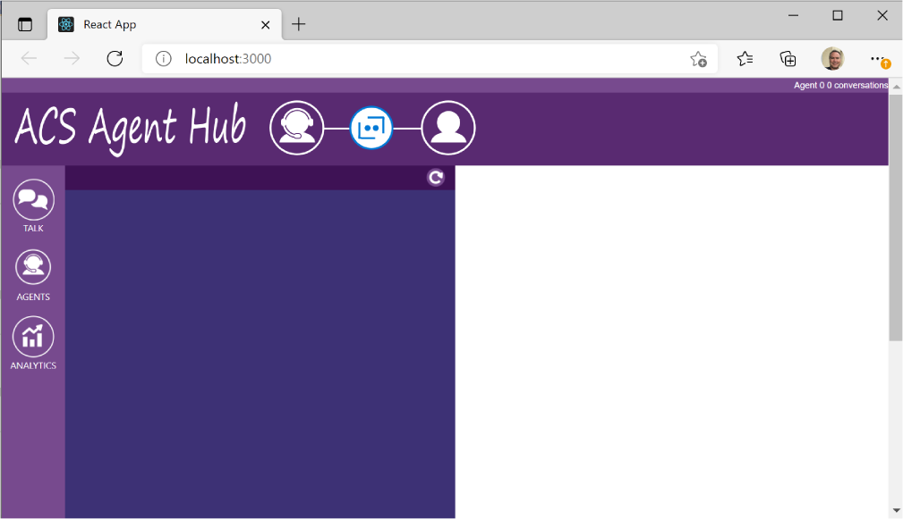
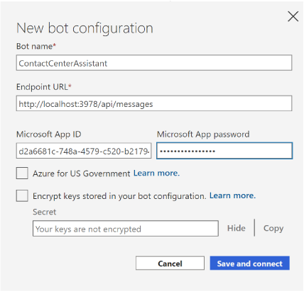

# ACS Agent Hub
The sample uses the Azure Communication Service and Azure Bot Service to implement a
contact center "call deflection" pattern where multiple agents can simultaneously engage 
with multiple customers in a ready-made agent portal that's also included in the solution

### <a name="Prerequisites"></a>Prerequisites

#### Ngrok
To install ngrok, follow instructions [here](https://ngrok.com/download)

#### Azure CLI
The deployment scripts require Azure CLI version 2.22.0 or newer which you can install from [here](
https://docs.microsoft.com/en-us/cli/azure/install-azure-cli-windows?tabs=azure-cli).

#### Azure Communication Service CLI Extension

To install the Azure Communication Service extension, run the following from a command prompt:
```
az communication create
```
#### Web PubSub CLI Extension
To install the Web PubSub extension, run the following from a command prompt
```
az webpubsub
```
Note - The output of this command may be messy with a lot of diagnostics before it prompts to
install the extension so be aware of that.

#### Azure Functions Core Tools
The core agent hub logic lives in a set APIs in the ACSAgentHub Azure Function project and to quickly
test things out you can run it locally from the command line but you'll need to have the Azure 
Functions Core Tools v3.X installed.  Alternatively, you can avoid installing the Azure Functions Core
Tools if you use Visual Studio to run the ACSAgentHub Azure Function project.

To install Azure Function Core Tools v3.X you'll need to download and run the Core Tools installer, based on your version of Windows:

* [v3.x - Windows 64-bit](https://go.microsoft.com/fwlink/?linkid=2135274)
* [v3.x - Windows 32-bit](https://go.microsoft.com/fwlink/?linkid=2135275)

### <a name="GettingStarted"></a>Getting Started

After taking care of the [prerequisites](#Prerequisites), do the following:

1) **Clone the ACS Agent Hub Repo**  
Open PowerShell and run the following command:
```
git clone https://github.com/managedcoder/ACSAgentHub
```
2) **Deploy ACS Agent Hub**  
In PowerShell, change the current directory to the root solution folder (i.e., the one
that contains the ACSAgentHub.sln file). Then run the following script to deploy and
configure all the services required by the ACS Agent Hub:
```
.\Deployment\Scripts\deploy_acs_agent_hub.ps1 -hubName <hub name> -location <region>
```
where <hub name> is the name of your agent hub which will used in creating the various
required services.

3) **Start Agent Hub Service**  
The core agent hub logic lives in a set APIs in the ACSAgentHub Azure Function project and
to quickly test things you can run it locally.  In PowerShell, change the current directory
to the ACSAgentHub project folder.  This project folder is a subfolder of the solution
folder you used in previous step so you'll need to ```cd ACSAgentHub``` where the
.\ACSAgentHub\ACSAgentHub.csproj file lives and then run the following command:
```
func start
```
4) **Create Agent**  
In PowerShell, create an agent in Azure Storage by running the Curl command below. You'll
need to add at least one agent to be able to sign in to the agent-portal.
```
   curl -X POST http://localhost:7071/api/agents `
     -H "Content-Type:application/json" `
     -d '{
       \"id\": \"1\",
       \"name\": \"Agent 1\",
       \"status\": 1,
       \"skills\": [ \"skill 1\", \"skill 2\", \"skill 3\" ] 
     }'
```
**Note:** The syntax for the version of Curl that distributes with Windows requires special quoting that would need to
be modified to run this with a non-Windows version of Curl

5) **Create Tunnel to Agent Hub**  
For this step, open a separate Command Promt and run the following command to create a 
tunnel for use later when you subscribe message events. The ngrok command does not return 
and instead listens for endpoint traffic.  The tunnel that ngrok exposes will be live and
accessible as long as that Command Prompt is open. We'll use this tunnel to bridge agent
messages to their corresponding bot user.
```
c:\ngrok\ngrok http 7071 -host-header=localhost:7071
```
6) **Subscribe to ACS Message Event**  
Open PowerShell and change the current directory to the root project folder (i.e., the one that contains the
ContactCenter.sln file.  Run the following script and pass the ngrok endpoint (the https version) to have
Event Grid call the bot's messaging webhook when agents chat:
```
.\Deployment\Scripts\update_webhook.ps1 -hubName <hub name> -endpoint "https://<############>.ngrok.io/api/agenthub/messagewebhook"
```
Where \<hub name\> is the same name you used earlier when you ran the deploy.ps1 script.

7) **Install npm Packages**  
Open a new command prompt window and from the agent-portal's project folder (the one that contains package.json), run the following command:<br><br>
```
npm install
```
8) **Launch Agent-Portal**  
In the command prompt window you opened in the previous step, run the following command:
```
npm start
```
It will take a minute or two for npm to build the agent-portal and start it in the browser but when it does you'll be able to sign 
in as one of the agents in the list.  Once you've successfully signed in you'll see an empty list of conversations and the window 
will look something like this:<br><br>


9) **Add ACS Agent Escalation to Your Bot (optional)**
You can add ACS agent escalation to your existing bot or create a new bot using the bot template of your choice and then add
escalation to it.  Alternatively, you can use one of the ready-made bot examples (ComposerExample or VATemplateExample) which
already has escalation integrated and skip past this step.

For a detailed explanation of how to add escalation to an new or existing bot, see the XXX section in this README.

10) **Launch Bot Emulator and Escalate to Agent**  
Launch bot emulator and select **File | New Bot Configuration** and enter a name for the emulator profile then enter
http://localhost:3978/api/messages in the **Endpoint URL** field.  You'll also need to enter the **Microsoft App ID** and **password** 
from the appsettings.json file in the root folder for the VATemplateExample project. When you've entered those values, click the
**Save and connect** button and, for convience, save the profile in the VATemplateExample's project folder (it's gitignored).<br><br>
<br><br>
After you've successfully launched the bot emulator and you've seen the Welcome prompt, type the following into the bot emulator's 
message field:<br><br>```talk to human```<br><br>
Follow the conversational prompts to escalate conversation.

11) **Accept the Escalation**  
After you have successfully escalated to an agent in the bot emulator, switch to agent portal and click the green answer button to
accept the escalation request and take ownership of the conversation.

11) **Chat Back and Forth**  
Type messages in the agent-portal and the bot emulator and when finished click the hangup button

### <a name="AddingAgentEscalationToNewOrExistingBot"></a>Appendix A: Agent Escalation in a VA Template Bot
If you want to add agent escalation to a Virtual Assistant Template bot, you can explore
how that's done in the VATemplateExample sample project.  If you want to quickly test this
out, you can open PowerShell and change the current directory to the VATemplateExample 
project folder (i.e., the one that contains the VATemplateExample.csproj file).  The Run
the deploy.ps1 script using the following relative path:
```
.\Deployment\Scripts\deploy.ps1 -name <name of bot> -location <region> -appPassword <password> -createLuisAuthoring -luisAuthoringRegion westus
```
This script deploys and configures all the services required by the virtual assistant.  
The name of the bot must be Internet-unique and the location is a region name 
line **eastus** and the password must be 16 characters long and the -luisAuthoringRegion
parameter must be **westus** for US deployments.